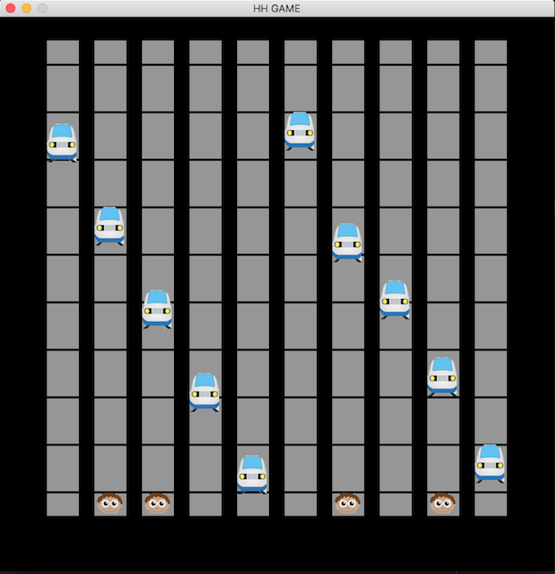

# Hogwarts Hobo Game

This application consists in a game which is made by 10 tracks, 10 trains and some Hobos. The objective of the game is to stay alive as long as possible. You are going to be the blue square printed on the third lane.
When you give the command to start the game, the trains will start to pass through the lanes (tracks) and you and the other hobos are going to jump through tracks when almost hit by the train in the current track.
When you ARE hit by a train (either when the train pass and hit you or when you jump to a track which has a train passing) you lose health. When you lose all your health, the game stops.
This game is not completed yet, it needs to correct the implementation of the player and the hobo, the interface to start the game.



## Installation

You will only need to install python3 in your machine. Follow the guide provided by
https://realpython.com/installing-python/

## Usage example

It is very simple to run this game. just run in your terminal (after downloading/cloning it from github):

```sh
python3 game.py
```

## Development setup

The only dependency you will need to install is pygame. It is very simple to install it. After you install python3, you will have the "pip3" command installed as well. So you will need to run:

For MacOS:

```sh
sudo pip3 install pygame
```

It is going to ask your password (because of the sudo command).
If it did not work you can follow this tutorial on youtube: https://www.youtube.com/watch?v=e-whas6qzsu

For Windows 8 to 10:

```sh
pip3 install pygame
```

If it did not work you can follow this tutorial on youtube: https://www.youtube.com/watch?v=aduzara-kzw

## Contributors

1. Filipe Gorodscy -- Responsible for most of the coding part of the project. Worked hard to learn and implement pygame. Responsible for the coding design and also responsible for the "Introduction" part of the Product Backlog. Also designed some of the diagrams to make it easier for everyone to understand the project.

2.

3.

4.
